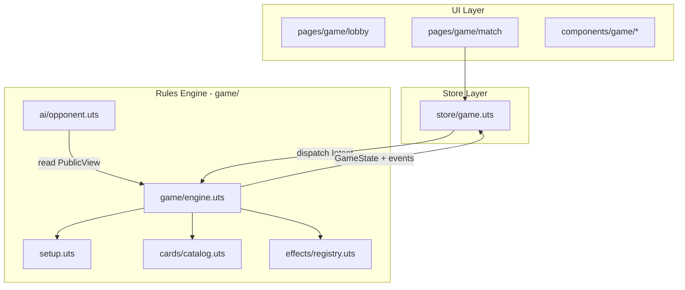
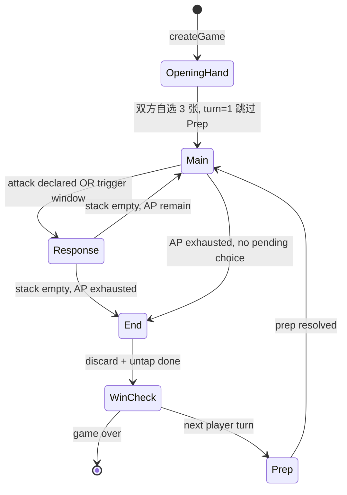

# feat: 双人卡牌游戏（全卡 + 人机对战）

## Summary

在 `legend2`（uni-app-x）中从零实现一套可玩的**双人对局**数字卡牌游戏：人类玩家对战 AI，覆盖完整回合流程、双阵营分色牌库/弃牌区、全部皇室与魔物卡牌效果、EX 与双人专属平衡规则，以及两种胜利条件。规则引擎与 UI 分离，引擎可独立测试与回放。

---

## Problem Frame

`legend2` 当前为 DCloud `hello-uvue` 模板工程，尚无游戏逻辑。用户提供了完整的实体桌游规则（皇室/魔物双阵营、97 张卡牌体系、三阶段回合、复杂关键词与双人平衡细则），需要在移动端实现**首版即包含全部卡牌**、**单人对战 AI** 的可玩版本。

成功标准：玩家可在 App 内完成一局完整双人对战，规则与用户提供文档一致；AI 能合法完成回合并在触发窗口做出合理响应；核心规则可通过自动化测试回归。

---

## Requirements

- R1. **双人对局 Setup**：黄/紫牌库拆分洗牌；铁匠、格斗家各 3 张；每色牌库随机注入 1 张 EX 后其余 EX 移出；**无公共金币池**；双方各**自选牌库抽牌 3 次**组成起手（每次从皇室或魔物牌库顶抽 1 张，可混色）；随机先手，第一回合跳过准备阶段。
- R2. **回合三阶段**：准备阶段（收回横置持续卡、≥2 张收回得 1 金币、准备阶段触发效果）→ 主要阶段（2 行动点，抽牌/出牌各耗 1 点）→ 结束阶段（手牌上限 4、场上持续卡竖置）。
- R3. **卡牌三类**：攻击卡仅主要阶段对对手；触发卡任意时刻（含被攻击瞬间）；持续卡横置留场，仅自身准备阶段收回。
- R4. **关键词与结算**：LV 0–6；放置 vs 弃置；宣言；纹章（皇冠/魔龙）；多效果顺序：被动持续先、主动后；史莱姆单回合限 1 张；龙蛋在场才能打火龙。
- R5. **胜利条件**：任意玩家达到 5 金币即满足速胜条件（在效果栈清空后判定并结束对局）；或两色抽牌堆均空后比金币，平则比手牌数。
- R6. **全部卡牌效果**：实现用户文档第五节（皇室）与第六节（魔物）所列全部基础卡与 EX 卡，含双阵营 EX 持续卡魔剑。
- R7. **双人专属平衡**：魔王仅「双方每回合抽牌 -1」（无 4–5 人概率失效）；群体攻击仅作用于唯一对手；EX 各 1 张随机。
- R8. **AI 对手**：AI 作为第二玩家，遵守相同规则；能完成主要阶段决策与触发卡响应；不偷看对手手牌。
- R9. **移动端体验**：清晰展示阶段、行动点、个人金币、手牌、场上牌、分色弃牌堆、牌库剩余；起手选牌 UI；AI 回合有明确反馈；App 切后台可恢复对局。
- R10. **可测试性**：规则引擎纯函数、确定性随机种子、Golden Scenario 覆盖关键交互。

---

## Key Technical Decisions

- KTD1. **引擎/UI 分离**：`game/` 目录存放纯 UTS 规则引擎（无 Vue/reactive）；UI 仅 dispatch `Intent`，以引擎返回的 `GameState` + `PendingChoice` 驱动渲染。便于单测与 AI 模拟。
- KTD2. **数据驱动效果 + 特化 Handler**：卡牌定义用判别联合 `Effect` AST；原子效果走 Registry；复杂卡（国王邻接判定、圣杯即时胜、火龙夺牌、五娘拦截等）用 `custom` handler，每张附 Golden Scenario。
- KTD3. **简化 Priority 栈**：采用「响应窗口 + LIFO 栈」，非完整 MTG AP/NAP。攻击声明 → 双方可打触发卡 → 栈顶优先结算 → 被动持续先于主动。触发响应**不消耗行动点**；攻击已声明则行动点不退还。U4 完成前用 3 张代表卡（卫兵/勇者/女巫）做 spike，验证栈能否承载全部卡牌时序；不通过则升级为双玩家 priority pass。
- KTD4. **确定性 RNG**：Setup 洗牌、EX 抽取、先后手均用 `SeededRng`；引擎内禁止 `Math.random()`，支持测试回放。
- KTD5. **AI 架构**：`PublicView` + 规则脚本（致死线、必挡、高价值触发）+ Greedy 评估（金币差、场面控制、手牌质量）；Normal 难度首版目标；单步决策 < 2s。起手 3 张由 AI 按公开牌库信息自选。
- KTD6. **状态持久化**：`uni.setStorageSync` 序列化 `GameState`；`onAppHide` 写入、`onShow` 恢复；半完成选择（弃牌、宣言选牌）一并保存。
- KTD7. **UI 技术栈**：组合式 `<script setup lang="uts">`；游戏状态经 `store/game.uts` reactive 包装；组件放 `components/game/`。
- KTD8. **范围边界**：首版仅 2 人局（1 人 + AI）；不含 3–5 人、联机、Deck 构筑 UI（固定 Setup 规则生成牌库）。

---

## High-Level Technical Design

### 组件分层



### 回合与效果解析



### 效果结算顺序（引擎 invariant）

1. 状态检查（个人金币 ≥ 5、牌库空等）在**效果栈清空后**执行，不在链中途判胜。
2. 同批触发：被动持续效果先于主动打出效果。
3. 响应栈：LIFO；触发卡响应不耗 AP。
4. 弃牌严格分色：黄→皇室弃牌堆，紫→魔物弃牌堆。
5. **无公共金币池**：获得金币时直接增加玩家 `gold`，不从公共池扣减。

---

## Output Structure

```
game/
├── types.uts                 # Card, Player, Phase, Intent, GameState
├── rng.uts                   # SeededRng
├── setup.uts                 # 双人局初始化
├── phases.uts                # 阶段转移与 AP
├── engine.uts                # reduce / dispatch 入口
├── win.uts                   # 胜负判定
├── persist.uts               # 对局序列化与恢复
├── cards/
│   ├── catalog.uts           # 全卡元数据索引
│   ├── royal.uts             # 皇室卡定义
│   ├── monster.uts           # 魔物卡定义
│   └── ex.uts                # EX 卡定义
├── effects/
│   ├── registry.uts
│   ├── interpreter.uts
│   └── handlers/             # custom 特化
├── ai/
│   ├── opponent.uts
│   ├── evaluate.uts
│   └── rules.uts
└── views.uts                 # PublicView / PlayerView 投影

store/game.uts

components/game/
├── phase-bar.uvue
├── gold-display.uvue          # 玩家个人金币（非公共池）
├── card.uvue
├── hand-zone.uvue
├── field-zone.uvue
├── discard-pile.uvue
├── opening-hand-picker.uvue   # 起手自选 3 张
├── action-bar.uvue
├── choice-modal.uvue
└── game-log.uvue

pages/game/
├── lobby/lobby.uvue
├── match/match.uvue
└── result/result.uvue

static/game/cards/            # 卡面图（可占位）

game/__tests__/
├── catalog.test.uts
├── setup.test.uts
├── phases.test.uts
├── effects.test.uts
├── win.test.uts
├── ai.test.uts
├── persist.test.uts
├── sim-smoke.uts
├── golden/                   # JSON 场景
└── properties.test.uts
```

---

## Scope Boundaries

**In scope：** 全部卡牌、双人 Setup（含起手自选）、完整回合、AI 对战、分色弃牌、两种胜利、App 生命周期存档、引擎单测与 Golden Scenario。

**Out of scope：** 3–5 人局、联机/房间、人类双人对战热座（架构可扩展但首版不做）、Deck 构筑界面、卡牌动画/音效 polish、教程系统、排行榜。

### Deferred to Follow-Up Work

- 3–5 人局与对应 EX/魔王扩展规则
- 联机对战与同步架构
- 本地双人对战（热座）模式
- 卡牌原画资源替换占位图
- 难度分级 AI（Hard / OEP）
- 清理 hello-uvue 演示页（154 条路由）

---

## Assumptions

- 响应窗口打触发卡不消耗行动点；攻击声明后 AP 不退还（即使被无效化）。
- **无公共金币池**：数字版不实现实体桌游的 21 枚公共池；所有金币增减仅作用于玩家个人 `gold`。
- **起手自选**：Setup 建库后，双方各**自选牌库抽牌 3 次**（每次选皇室或魔物牌库，从牌库顶抽 1 张，可混色）；人类在 UI 完成，AI 脚本完成；双方选满后开局。
- 魔王「抽牌 -1」仅作用于准备阶段内的抽牌行为；第一回合无准备阶段故不生效。
- 无法在需要时从空牌库抽牌即触发 deck-out 终局判定（效果栈清空后检查）。
- 金币与手牌完全相同判和局。
- AI 仅使用公开信息（双方弃牌堆可见，不可见对手手牌）。
- 卡面 faction 决定弃牌堆颜色（混色手牌按卡面分堆）。
- 首版目标平台以 App 为主，微信小程序通过条件编译后续适配。

---

## System-Wide Impact

- **pages.json**：新增 `pages/game/*` 路由，首页改为游戏大厅；保留或隔离演示页。
- **manifest.json**：`singleThread: true` 要求长效果链分步结算，避免 ANR。
- **store/**：新增 `game.uts`，与现有 `index.uts` 设备信息并存。
- **测试**：引入引擎层 `.uts` 测试（HBuilderX 或 Node 侧脚本，见 U11）。

---

## Risks & Dependencies

| 风险 | 缓解 |
|------|------|
| 30+ 卡牌效果组合爆炸 | Registry + Golden Scenario 每卡至少 1 条；本地 smoke 脚本（U11 sim-smoke.uts） |
| 触发窗口 UI/引擎不同步 | 引擎为唯一真相；UI 只读 `pendingChoice` |
| UTS 单线程长链卡顿 | 效果链分 tick 推进；AI 决策异步 yield |
| 规则歧义（贴吧修正版） | 计划内 Assumptions 写死；争议点附 Golden 固化 |
| 无 git / 无 CI | 本地测试脚本 + HBuilderX 自动化 |

**依赖：** HBuilderX ≥ 3.96、uni-app-x ≥ 4.03。

---

## Phased Delivery

| 里程碑 | 单元 | 可玩/可验目标 |
|--------|------|----------------|
| M1 引擎骨架 | U1–U4 | Golden 跑通 Setup + 回合 + 卫兵响应 |
| M2 全卡规则 | U5–U7 | 每张具名卡 ≥1 Golden；deck-out 与 5 金结算 |
| M3 人机可玩 | U8–U9 | App 内完成一局；AI 合法出牌 |
| M4 稳定化 | U10–U11 | 切后台恢复；1000 局 smoke |

U5/U6 可并行，但 U8 依赖 U5+U6 全卡完成后再集成。

---

## Implementation Units

### U1. 领域类型与全卡目录

**Goal：** 定义引擎核心类型并登记全部卡牌元数据（名称、颜色、类型、LV、纹章、效果 AST）。

**Requirements：** R4, R6

**Dependencies：** 无

**Files：**
- `game/types.uts`
- `game/cards/catalog.uts`
- `game/cards/royal.uts`
- `game/cards/monster.uts`
- `game/cards/ex.uts`
- `game/__tests__/catalog.test.uts`

**Approach：** `CardDef` 含 id、faction、cardType（attack/trigger/continuous）、level、emblem、effects[]。皇室 15+、魔物 15+、EX 与双阵营卡全部录入。

**Patterns to follow：** `store/index.uts` 的 `export type` + 强类型风格。

**Test scenarios：**
- _catalog 包含用户文档所列每一张具名片（铁匠、格斗家、国王…魔剑、魔王等），无遗漏
- 每张卡 cardType 与文档标记（△/⚡/●）一致
- 史莱姆、公主、曾吕等「特殊无行动消耗」标记正确
- 铁匠/格斗家基础 copyCount：双人 Setup 用 3（在 catalog 存 baseCount，Setup 读取 playerCount 调整）

**Verification：** 运行 catalog 测试；人工对照用户卡牌清单逐项勾选。

---

### U2. 双人局 Setup 与牌库管理

**Goal：** 实现洗牌、分色牌库/弃牌堆、EX 随机注入、起手自选 3 张、先后手。

**Requirements：** R1, R7

**Dependencies：** U1

**Files：**
- `game/setup.uts`
- `game/rng.uts`
- `game/__tests__/setup.test.uts`
- `game/__tests__/golden/two-player-setup.json`

**Approach：** `createGame(seed, { playerCount: 2 })` 返回初始 `GameState`：双抽牌堆、空弃牌堆、**无 `goldPool` 字段**、空手牌、`phase=OpeningHand`（或 `pendingChoice=OpeningHandPick`）。EX 从 exPool 各随机 1 张注入后移出其余 EX。双方通过 `pickOpeningHand` Intent 各自**选牌库抽牌 3 次**（仅指定 `pile`，从牌库顶抽取）；选满后 `firstPlayer` 开始 `turn=1`、`phase=Main`。

**Test scenarios：**
- 固定 seed 下 EX 注入结果可复现
- 铁匠 3 张进入黄库，格斗家 3 张进入紫库
- 双方各自选 3 张后，手牌总数 6、对应牌库各减少 3 张
- 自选可混色（例如 2 黄 1 紫）
- 选牌未完成时不可进入 Main 阶段
- 先手玩家第一回合 phase 为 Main（跳过 Prep）
- 移出的 EX 不在任何牌库中
- 获得金币时不检查、不扣减公共池

**Verification：** Golden `two-player-setup.json` replay 一致。

---

### U3. 回合阶段状态机与行动点

**Goal：** Prep / Main / End 转移；2 AP 消耗；手牌上限；持续卡竖置/横置。

**Requirements：** R2, R3

**Dependencies：** U2

**Files：**
- `game/phases.uts`
- `game/engine.uts`（阶段部分）
- `game/__tests__/phases.test.uts`
- `game/__tests__/golden/turn-cycle.json`

**Approach：** `GamePhase` 枚举；Main 中 `spendAction(draw|play)`；End 检查 hand>4 触发 `PendingChoice.Discard`；Prep 收回 field 持续卡，≥2 张 +1 金，触发公主/圣杯等准备效果。

**Test scenarios：**
- 第一回合无 Prep，第二回合起有 Prep
- Main 阶段 2 抽 / 2 打 / 1 抽 1 打 均合法
- AP 耗尽后不可再抽/打
- End 阶段手牌 6 张必须弃至 4
- End 后场上横置卡变竖置
- 准备阶段收回 2+ 张场牌获得 1 金币

**Verification：** Golden `turn-cycle.json` 覆盖完整两回合循环。

---

### U4. 效果引擎框架

**Goal：** Intent 校验、效果栈、响应窗口、关键词（放置/弃置/宣言/LV/纹章）、结算顺序。

**Requirements：** R3, R4

**Dependencies：** U1, U3

**Files：**
- `game/effects/registry.uts`
- `game/effects/interpreter.uts`
- `game/effects/handlers/`（占位）
- `game/engine.uts`
- `game/__tests__/effects.test.uts`
- `game/__tests__/golden/trigger-response.json`

**Approach：** `dispatch(state, intent)` → 非法则不变；合法则 `apply` + `runResolutionLoop`。攻击声明开 `ResponseWindow`；触发卡入栈顶；`resolveOrder: passiveContinuous → active`。

**Execution note：** 先写 Golden「攻击 → 卫兵无效 → 攻击卡放置攻击者场上」失败测试，再实现框架。

**Test scenarios：**
- 非 Main 打攻击卡被拒绝
- 攻击声明后对手可打触发卡，自己 Main AP 不变
- 多效果同时触发：被动持续先于主动
- 放置不进入弃牌堆；弃置进入对应颜色弃牌堆
- 宣言 LV/名称：对手有则展示/交出，无则 +1 金
- 跨阵营不可从弃牌堆捡牌（除非卡牌明示）

**Verification：** Golden `trigger-response.json`（卫兵场景）通过。

---

### U5. 皇室阵营全卡效果

**Goal：** 实现第五节全部皇室卡效果。

**Requirements：** R4, R6

**Dependencies：** U4

**Files：**
- `game/effects/handlers/royal/`（按卡拆分）
- `game/__tests__/golden/royal/`（每卡或每组 1 个 JSON）

**Approach：** 逐卡注册 custom handler 或组合原子 effect。重点：公主（打出不耗 AP）、圣杯（准备阶段差 1 金胜）、圣剑（改勇者效果、翻面火龙）、铁匠/格斗家（铺场）、曾吕/五娘、EX 圣骑士/大魔导师。

**Test scenarios（代表性，implementer 每张卡至少 1 条）：**
- 公主：Main 打出不耗 AP；Prep +1 金
- 国王：需邻接勇者/卫兵；每打 LV≥4 皇室 +1 金
- 圣杯：Prep 时差 1 金直接胜；全场唯一
- 圣剑：自打勇者时改放置为弃置；可翻面火龙
- 铁匠：1 AP 铺 2 手牌；同 LV/纹章 +1 金
- 格斗家：1 AP 铺全部手牌；偶数且无纹章 +1 金
- 卫兵：被攻击时无效攻击，攻击卡放攻击者场上，摸 1
- 修女：对手弃 LV≥2 时收入手牌
- 勇者 LV4/LV5：放置魔物手牌；条件 +1 金
- 商人：金币多者付 1 金
- 曾吕：不耗 AP，从黄弃牌拿 LV1 以外皇室
- 五娘：对手得金瞬间可弃五娘换 1 金
- 圣骑士 EX：全场皇室 LV+2；无效 LV≤3 魔物攻击
- 大魔导师 EX：宣言 LV，无对应手牌 +1 金

**Verification：** `game/__tests__/golden/royal/` 全部通过。

---

### U6. 魔物阵营全卡效果

**Goal：** 实现第六节全部魔物卡效果。

**Requirements：** R4, R6, R7

**Dependencies：** U4

**Files：**
- `game/effects/handlers/monster/`
- `game/__tests__/golden/monster/`

**Approach：** 龙蛋/火龙联动、史莱姆单回合限 1、魔王双人 -1 抽牌、群体攻击仅唯一对手、EX 宝箱怪/黑骑士/小丑女等。

**Test scenarios（代表性）：**
- 龙蛋：LV0 前置；不受卫兵翻面；无龙蛋时火龙不可打且离场收回
- 火龙：对手抽牌时可弃 1 手夺牌
- 妖精：对手每弃 1 手牌 +1 金
- 哥布林：宣言名称弃牌；带 LV +1 金
- 白骨/龙炎：对手场上持续卡收回或竖置重置（双人仅 1 目标）
- 女巫：被皇室攻击时翻面攻击者 1 张场牌
- 史莱姆：+1 金；同回合第二张被拒绝
- 魔王 EX：Prep 抽牌 -1（双人规则）
- 宝箱怪 EX：得金时翻倍后弃置
- 黑骑士 EX：放置手牌；条件拿魔剑
- 魔剑 EX：攻击结算两次；被圣剑/卫兵克制

**Verification：** `game/__tests__/golden/monster/` 全部通过。

---

### U7. 胜利判定与终局结算

**Goal：** 5 金即时胜；deck-out 比金再比手牌；和局处理。

**Requirements：** R5

**Dependencies：** U3, U4

**Files：**
- `game/win.uts`
- `game/__tests__/win.test.uts`
- `game/__tests__/golden/victory-five-gold.json`
- `game/__tests__/golden/victory-deckout.json`

**Approach：** 每次效果栈清空后 `checkWin()`；5 金优先；两库空则终局比较；同分判和。

**Test scenarios：**
- 效果链中获得第 5 金，栈清空后判胜
- 两抽牌堆空、金币 4:3 → 3 金方胜
- 金币相同、手牌 3:2 → 2 张方胜
- 金币与手牌均相同 → 和局
- 圣杯准备阶段差 1 金触发速胜

**Verification：** Golden victory 场景通过。

---

### U8. AI 对手

**Goal：** AI 完成 Prep/Main/End 决策与触发响应。

**Requirements：** R8

**Dependencies：** U3, U4, U5, U6, U7

**Files：**
- `game/ai/opponent.uts`
- `game/ai/evaluate.uts`
- `game/ai/rules.uts`
- `game/views.uts`
- `game/__tests__/ai.test.uts`

**Approach：** `getLegalActions(publicView, aiPlayerId)` → 规则脚本优先（有致死、必挡触发、五金差 1）→ Greedy 评估选最优。响应窗口同步决策。`simulateAction` 用于 1 步 lookahead。

**Test scenarios：**
- AI 在 Main 阶段仅选择合法 action
- 被攻击且有卫兵时，高价值场景下打出卫兵
- 手牌 >4 时 End 弃牌选最低价值卡
- AI 不使用对手手牌信息（PublicView 断言）
- 固定 seed 自对弈 100 局无 invariant 违反

**Verification：** 100 局 smoke 无崩溃；AI 单步 < 2s。

---

### U9. 对局 UI 与交互

**Goal：** 可玩的人机对战界面。

**Requirements：** R9

**Dependencies：** U2–U8

**Files：**
- `store/game.uts`
- `pages/game/lobby/lobby.uvue`
- `pages/game/match/match.uvue`
- `components/game/opening-hand-picker.uvue`
- `components/game/*.uvue`
- `pages.json`（路由与 easycom）
- `pages/game/match/match.test.js`

**Approach：** Lobby 开始新局（可选 seed；难度固定 Normal，Hard/OEP 见 Deferred）；**起手阶段**展示牌库浏览与自选 UI（`opening-hand-picker`），人类选满 3 张后 AI 自选；Match 绑定 store，根据 `pendingChoice` 弹出选牌/弃牌/宣言 UI；阶段条 + AP 指示；AI 回合遮罩 + 日志。

**Patterns to follow：** `pages/index/index.uvue` 组合式结构；`store/index.uts` reactive 模式；`styles/common.css` flex 布局。

**Test scenarios：**
- 点击「开始游戏」进入起手选牌，可自选皇室/魔物牌库抽牌 3 次
- 选满 3 张后进入 match 主界面，显示 3 张手牌与个人金币（初始为 0）
- Main 阶段 AP=2 时抽牌按钮可点，抽后 AP=1；按钮显示牌库剩余数量
- 攻击声明时出现响应 UI（若人类持有触发卡）
- End 手牌超限出现弃牌选择，选够 4 张后可结束
- AI 回合玩家操作按钮 disabled

**Verification：** HBuilderX 自动化 match 冒烟测试通过。

---

### U10. 对局持久化与 App 生命周期

**Goal：** 切后台/恢复不丢局；半完成选择可续。

**Requirements：** R9

**Dependencies：** U9

**Files：**
- `game/persist.uts`
- `App.uvue`（onHide/onShow 钩子）
- `game/__tests__/persist.test.uts`

**Approach：** 序列化 `GameState` + `pendingChoice` + seed；恢复时校验版本号。

**Test scenarios：**
- 保存后加载 state 深度相等
- End 弃牌选了一半保存，恢复后继续选择
- 已结束对局恢复时进入结算页

**Verification：** persist 单测通过；手动切后台恢复验证。

---

### U11. 测试体系与 CI 脚本

**Goal：** 引擎回归与随机 smoke 保障规则正确性。

**Requirements：** R10

**Dependencies：** U1–U8

**Files：**
- `game/__tests__/properties.test.uts`
- `game/__tests__/sim-smoke.uts`
- `package.json`（可选 test 脚本占位说明）

**Approach：** 不变量：卡牌总数守恒、determinism、hidden info；1000 局随机合法 action smoke。引擎 Golden 通过 `scripts/run-golden.uts`（UTS 纯逻辑，HBuilderX 运行或导出为可执行脚本）驱动；UI 冒烟沿用 HBuilderX 自动化 `match.test.js`。不在首版引入 Node/Jest 跑 `.uts`——避免与 uni-app-x 工具链脱节。

**Test scenarios：**
- 同 seed + 同 action 序列 → 相同 state hash
- 随机对局 1000 局：无 exception，均 reach gameOver 或 maxTurns
- 卡牌守恒：任意合法序列后全 zone 卡数不变

**Verification：** smoke 脚本本地可跑；Golden 目录覆盖 catalog 每一张具名卡（≥30 条，以 U1 catalog 条目数为下限）。

---

## Open Questions

（规划阶段已按 Assumptions 闭合；实现中若遇规则冲突，以 Golden Scenario + 用户文档为准，并更新 Assumptions。）

---

## Documentation Plan

- 首版不单独写玩家规则书；Lobby 页提供简要规则链接或折叠说明。
- 开发者注释：`game/types.uts` 顶部说明 Intent/Phase 词汇表（含 `OpeningHandPick`；**不含** `goldPool`）。

---

## Sources & Research

- 用户提供完整规则文档（本计划 Requirements 来源）
- 仓库调研：`legend2` 为 uni-app-x hello-uvue 模板，无既有游戏代码
- 外部最佳实践：数据驱动 Registry + Reducer FSM + Golden Scenario 测试（Cardinal Codex / boardgame.io 模式）
- 流程分析：触发窗口、deck-out、AI 决策点、App 生命周期缺口已纳入 Assumptions 与 Implementation Units
